# CrowdHeritage Introduction

## What is CrowdHeritage?
CrowdHeritage is an open platform for organising online crowdsourcing campaigns that mobilise people to improve the quality of cultural heritage collections. This could be in relation to different aspects, from multilingual coverage and image analysis to semantic tagging and bias detection. Participants are invited to enrich digital collections, either by producing new information (e.g. adding geo-locations) or by evaluating and validating automatic outputs produced by digital tools (e.g. detected biased phrases). 

 The  platform was originally developed under the Europeana Generic Services project [CrowdHeritage](https://pro.europeana.eu/project/crowd-heritage) and has since been significantly extended and improved in the context of multiple projects in the domain of cultural heritage and beyond, e.g. [AI4Culture](https://www.ai4culture.eu/), [DE-BIAS](https://pro.europeana.eu/post/address-bias-in-your-cultural-heritage-collections-with-the-de-bias-project), [CitizenHeritage](https://www.citizenheritage.eu/), [EuropeanaTranslate] (https://pro.europeana.eu/post/building-on-state-of-the-art-machine-translation-services) and other. The platform has so far been used to organise more than 40 crowdsourcing campaigns with more than 980 unique contributors, generating around 112,000 annotations and evaluating more than 18,000.

# Navigating CrowdHeritage Website

## Sign in / Sign up
Visit `https://crowdheritage.eu/` and click on the **Sign in** button on the top right. A pop-up will appear asking for your preferred sign in method, or giving you the option to create an account if you don't already have an account.
You can browse thought the Campaigns and Collections without logging in, but you will not be able to contribute.

## Choosing a Campaign
Once you have entered your credentials, you will now be able to see your username on the top right.
Scroll down through the Campaign list on the main page and enter any Campaign you would like to contribute to. In this example, we will select the *Scenes and People from China* Campaign.

## Entering a Collection
Each Campaign consists of one or more Collections. You can view those Collections under the Campaign information, by scrolling down further. Each listed Collection has a title, the number of items it contains, the name of its curator and a thumbnail made of some sample images form that Collection. Select the collection you are interested in and click on it to enter it.

## Selecting an Item
Within the Collection, you will be presented with a description of that Collection and the Items it contains. You can choose which items you want to see, by selecting one of the *ALL ITEMS*, *MY ANNOTATED ITEMS*, *NOT ANNOTATED ITEMS* options on the selector.

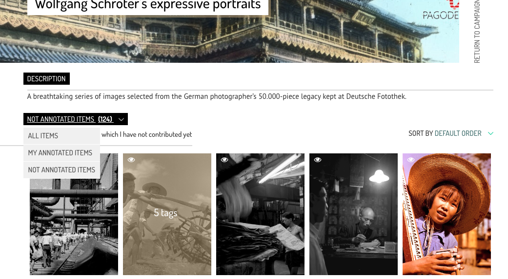

You can also sort the Items by *CONTRIBUTIONS COUNT* to focus on the collection items with the least contribution.

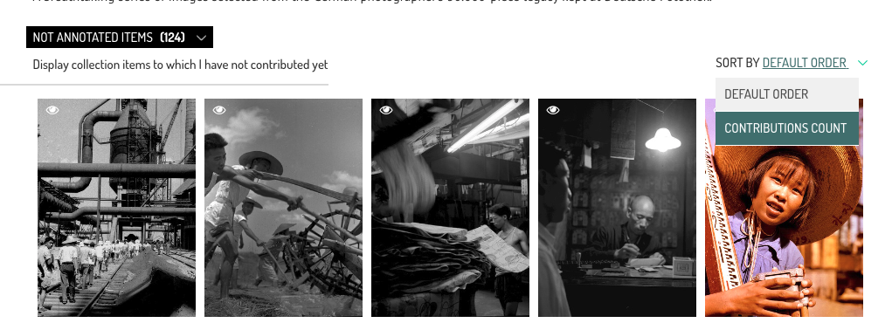

By hovering on the thumbnail of an Item, you can either click on it to enter the Item or click on the *eye* icon on the top left of each image in order to preview it - like so:

If you want to create annotations for am Item, click on it to access its page.

## Annotating an Item
There are four annotation types one can add to an Item.

1. **Semantic Tagging**
2. **Commenting**
3. **GeoTagging**
4. **ColorTaging**

### 1. Semantic Tagging
The first annotation type on the right sidebar are **semantic tags**. Semantic tags are predefined categories that can describe an Item. You can either *Upvote*, *Downvote* or *Remove* an existing tag by clicking the thumbs-up, thumbs-down or "X" icon next to that tag, respectively.

There is also the option to add a new tag by typing it in the input field. Since tags are predefined, once a user starts inserting text inside the input field, a list of relevant tags will appear in a drop-down list for the user to select most appropriate one.

### 2. COMMENTING
The second annotation type is a **comment**. Comments are text annotations, just like semantic tags, with the essential difference that they are a free-text strings instead of predefined strings. If a user feels that the information contained in the semantic tags is not adequate, they can add a custom text that conveys the information they want to add as an annotation.

Comments can also be *Upvoted*, *Downvoted* or *Removed* by other users.

### 3. GEOTAGGING
**Geotagging** is a special kind of tag that refers specifically to a location. A user can start typing the location name in the input field under the map, and then select the appropriate location from the suggested ones on the drop-down below. Geotags can also be *Upvoted*, *Downvoted* or *Removed* by other users.

### 4. COLORTAGGING

**Colortagging** is a special kind of tag that refers to color. A user can select the color from a predefined color pallette. Colortags can also be *Upvoted*, *Downvoted* or *Removed* by other users.

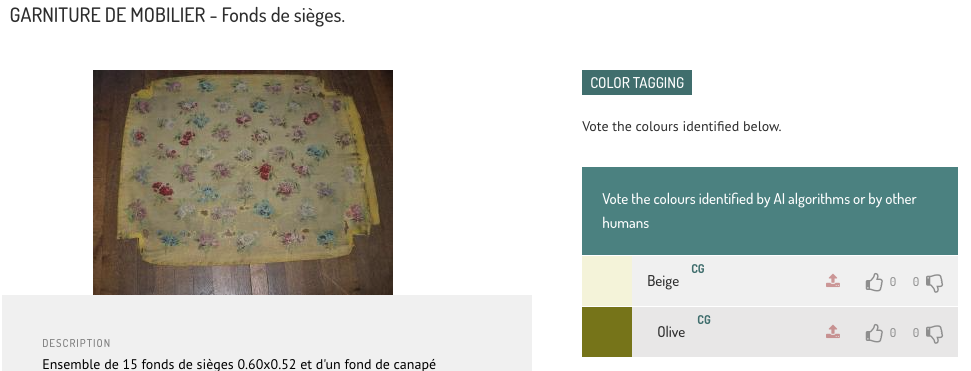

## Image Comparison

In *Image Comparison* campaigns, users can compare and rank the highest resolution image. A user can see the original image along with algorithm-generated ones (e.g. by Super-Resolution models). The user can then click *Compare* to start the comparison.

The original image is displayed at the top of the screen and below it (from left to right) the first algorithm-generated image, the original image in the same size as the computer-generated ones and the second algorithm-generated image. The user can zoom in a smaller window of the original image at the top and automatically the images at the bottom are displaying this smaller window. If the user wants to see the full images again he can stop the zoom process.

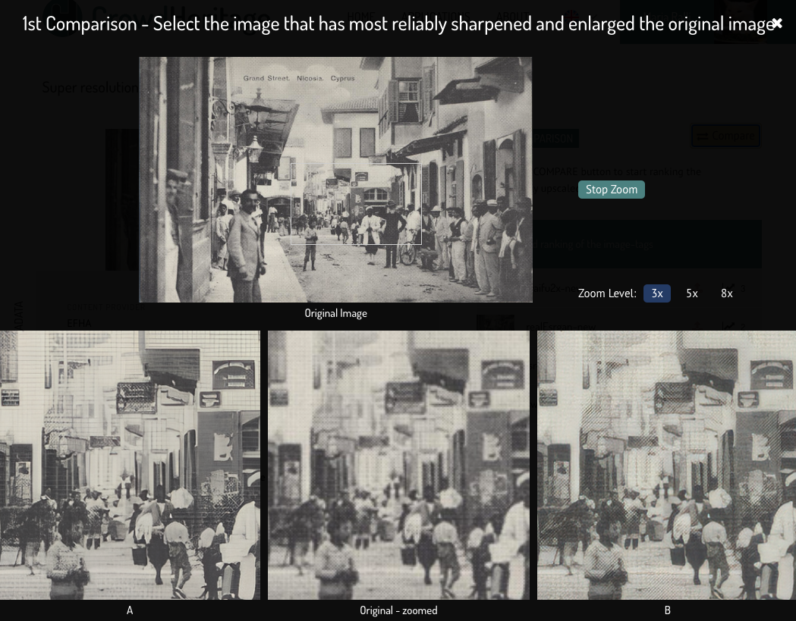

The user can then rank the images by clicking the image that most reliably sharpens and enlarges the original image. Then, we move on to the next comparison (6 comparisons in total). When the user finishes with all the comparisons, they submit them. After the submit, the user can see the results of their comparisons in the item view, where the number of “victories” are displayed for each algorithm.

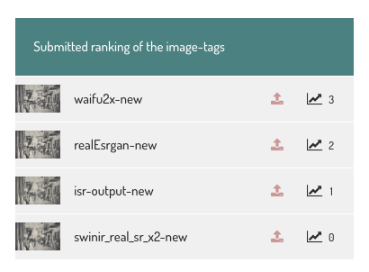

# Campaign Organizers' Tools
As a Campaign Organizer you have the additional capabilities to create and edit Campaigns, Collections, Vocabularies and Usergroups. As well as access to Campaign statistics and other moderating tools. We will first go through the **Dashboard** and then take a look on the **Moderating tools**.

## Dashboard
To access the dashboard, a signed-in Campaign Organizer should click on his username on the top right of the Navbar and then click on *Dashboard*.

Within the Dashboard, a user can view all the Campaigns, Collections, Vocabularies and Usergroups - each under the respective tab - as well as create new ones or edit existing ones.

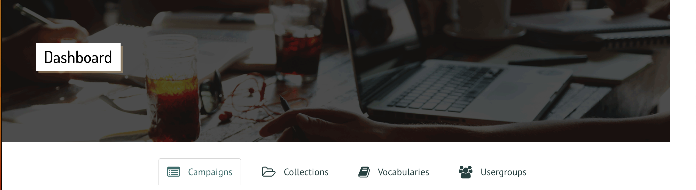

### Create/Edit Campaign
To create a new Campaign, click on the *+ New Campaign* button on the top right of the **Campaigns** tab (as seen on the above screenshot). A sidebar will appear on the right, asking to choose the Campaign's shortname. If the shortname already exist, you will be notified to select another.

Once you click on the *Create* button, your new Campaign will appear on the Campaigns list and you can click on it to edit any or all of the *Campaign Details*. There you also have multiple configuration options via the *Campaign Annotating*, *Campaign Access* and *Campaign Base Annotations* sections to customise the campaign according to your needs.

#### Campaign Details Section

This is a long list of input fields like: Visibility, Start/End Dates, Input Language, Banner, Description and so on. There are buttons to *Preview* and/or *Save* the Campaign after you are done.

The input fields marked as *(multilingual)* can be edited in multiple languages by selecting their appropriate language on the **Input Language** dropdown menu on top. This way, whenever a user views a Campaign, it will appear in their own language if the Campaign Owner has added the relevant text in the user's language.

#### Campaign Annotating Section

First, the user needs to select one of the available campaign types (basic, translate, image comparison) through the *campaign type* option.
Based on the campaign type different options become availablem.

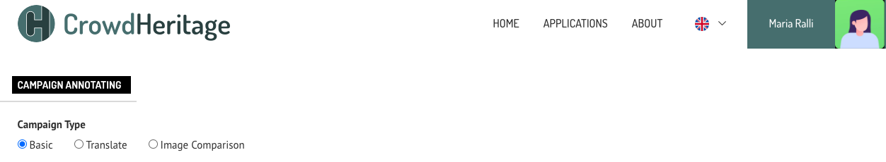

##### Campaign Type: Basic

The basic campaign type caters for the majority of scenarios a Campaign Organiser needs. It supports creating simple campaigns that are concerned with a single annotation type (e.g. semantic tagging), but it also supports the creation of complex campaigns, where the campaign organisers can specify multiple annotation types (semantic tagging,  colortagging, geotagging, commenting). The desired annotation types are specified via the “Campaign motivations" multi-select option.

Via the “Campaign purpose” option the campaign organisers can select whether the contributors should be able to create and validate or only validate existing annotations.

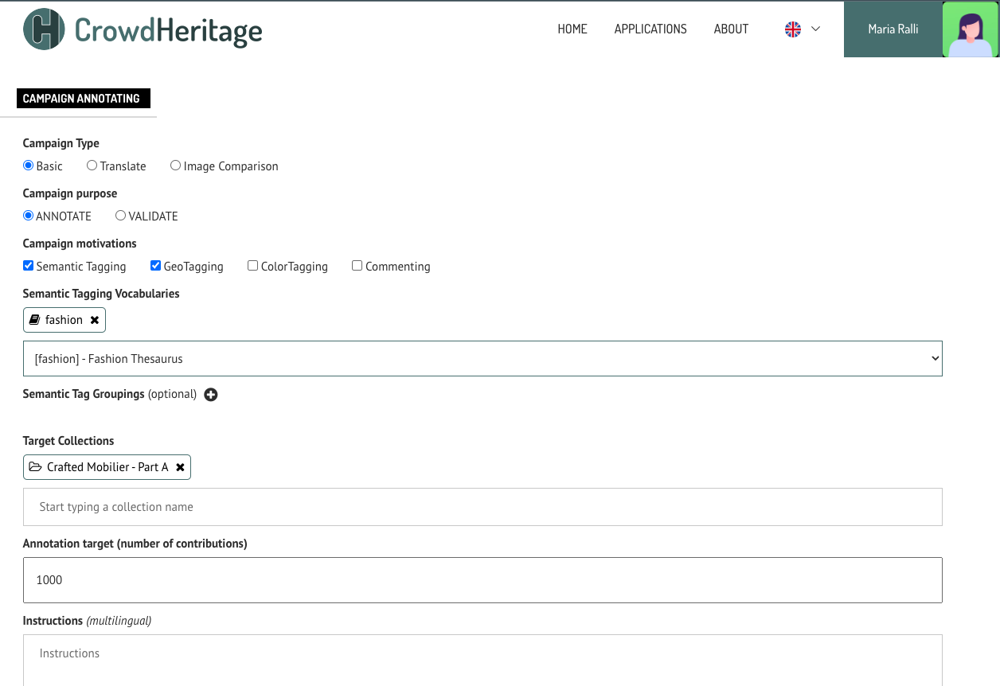

With *Semantic Tag Groupings* enabled:

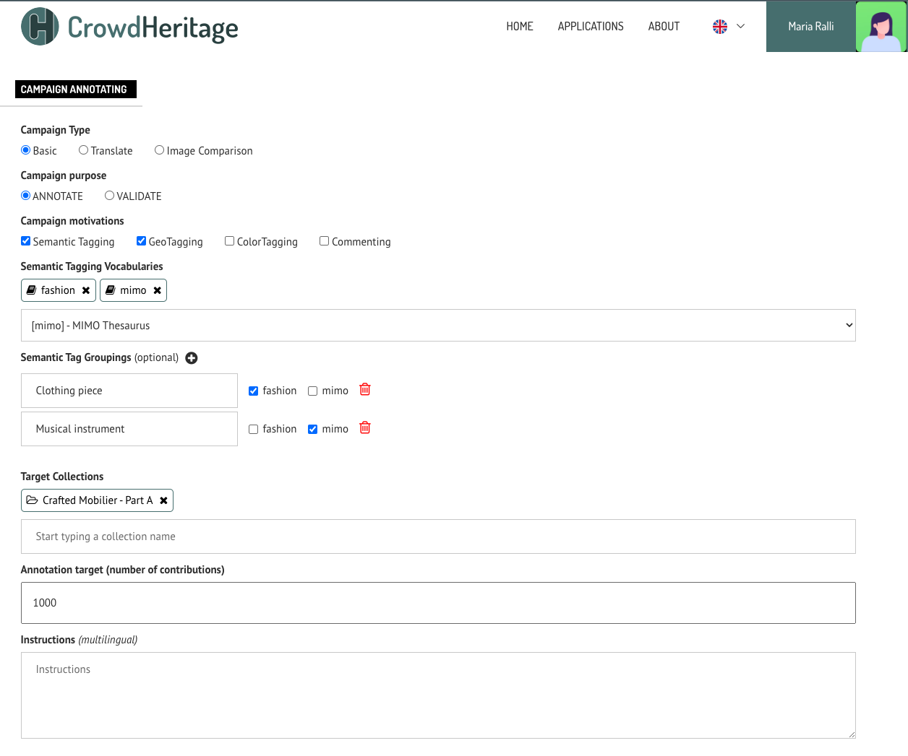

##### Campaign Type: Translate

The translate campaign enables running campaigns to validate translation annotations. For this campaign the percentage rating method is enabled by default, where the contributors can rate with a percentage bar the provided translation.

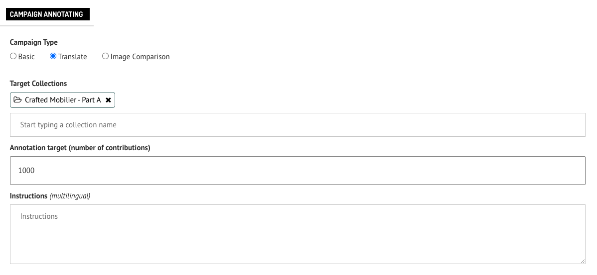

##### Campaign Type: Image Comparison

The image comparison campaign enables running campaigns via which human participants can compare and rank images produced by different image Super-Resolution (SR) models. For more info on how this looks like from the contributor side see the *Image Comparison* section.

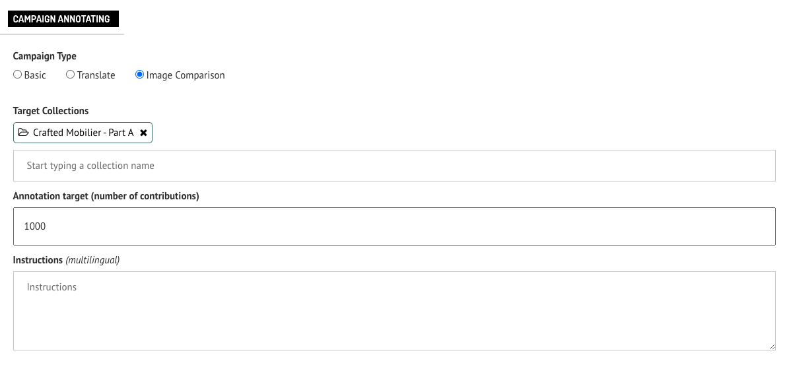

#### Target Collections

Via the “Target Collections” field the Campaign Organizer must select the collections of items the campaign should target. These collections are created and managed via the Collection Editor.

#### Campaign Access Section

Here, the Campaign Organizer can add extra campaign moderators and select any specific usergroups they want to target for the campaign. Both options are optional and offer auto-complete functionality.

#### Campaign Base Annotations Section

In this section the Campaign Organizer can import annotations to be used as *campaign base annotations*. Then, they can run the campaign to validate these annotations. The annotations can either be imported from MINT or via a JSON with the appropriate format.

Filling this section is required for the *image comparison* and *translate* campaign types, while it is optional for the *basic* campaign type.

*Note*: The imported annotations should conform to the expected [Annotation Model](_resources/Annotation_Model_5_3_24.pdf).

### Create/Edit Collection
Creating a Collection is a similar process as creating a Campaign. The user has to navigate on the **Collections** tab and click on the *+ New Collection* button. 

Then fill the requested information, and select the newly created Collection to import Items in.

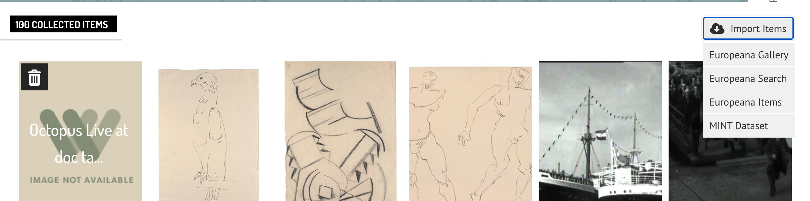

There are four options to import items when clicking the *Import Items* button.

1. Europeana Gallery - Import a whole gallery by entering the Europeana Gallery ID for that gallery
2. Europeana Search - Import a selected number of Items that contain a desired Search Term.
3. Europeana Items - Import specific Europeana Items by giving a list of those Items' URLs.
4. MINT Dataset - Import specific MINT Items by giving the MINT dataset's URL.

### Create/Edit Vocabulary
Creating a Vocabulary is a similar process. The user has to navigate on the **Vocabulary** tab and click on the *+ New Vocabulary* button. Name the vocabulary and click on the edit icon in order to add terms to it.

The terms can be either added one-by-one or batch imported as a CSV. They can also be Downloaded as a CSV. You can view all options by clicking *Manage Terms*.

### Create/Edit Usergroup
Lastly, we have Usergroups which follow a similar process. The user has to navigate on the **Usergroup** tab and click on the *+ New Usergroup* button to give the usergroup a name and description.

Once the group is created, click on the edit icon and add users in that group under the *Manage Users* section on the right sidebar.

## Moderate Campaign
When a Campaign Owner visits a Campaign page, a button named "Moderate Campaign" appears to him between the Campaign information and the Campaign's Collections.

This button navigates to a Campaign Moderation page which provides moderation tools that only a Campaign Owner has access to.

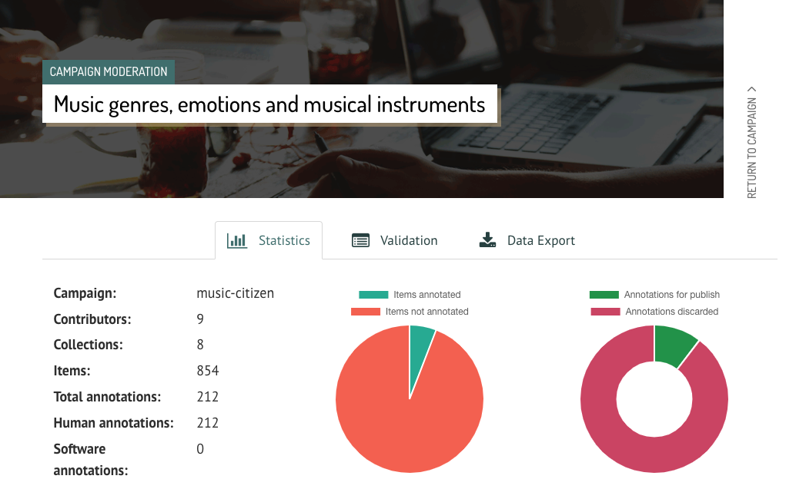

### Statistics
By clicking the *Statistics* button, the Campaign Owner can view some statistics about that specific Campaign, like total items, total annotations, annotation upvotes, contribution status  etc.

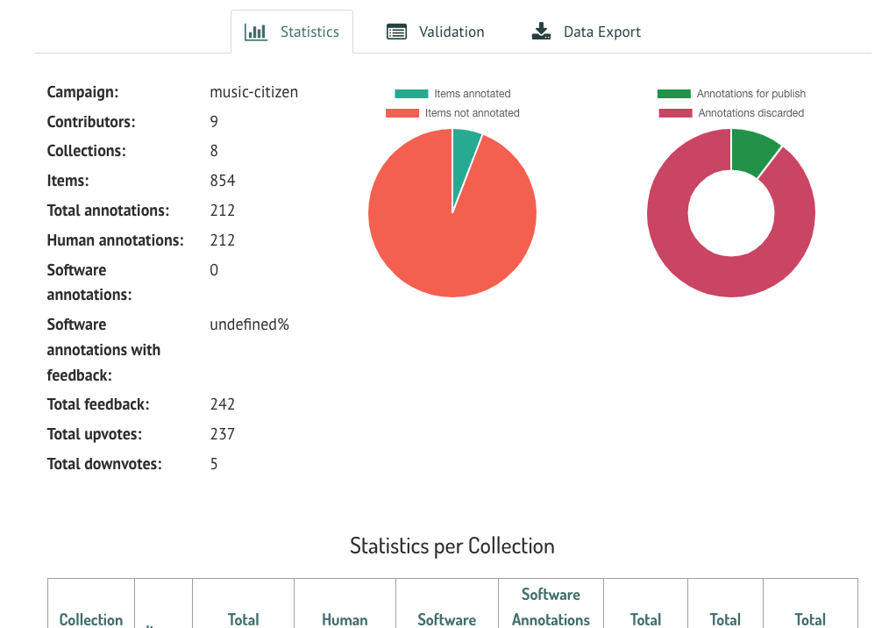

### Validation
By clicking on the "Validation" tab, the Campaign Owner can automatically validate the produced annotations, based on the feedback (upvotes/downvotes) they have received by the campaign contributors.

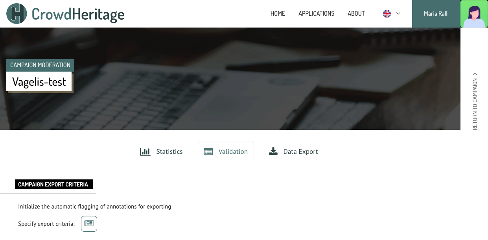

### Campaign Export Criteria
The *Specify Export Criteria* button opens a pop-up page which allows the Campaign Owner to configure the criteria the exported annotations need to fulfil. Only annotations that fulfil the criteria will be included in the data export. The *minimum annotation score* is the sum of the upvotes minus the downvotes.

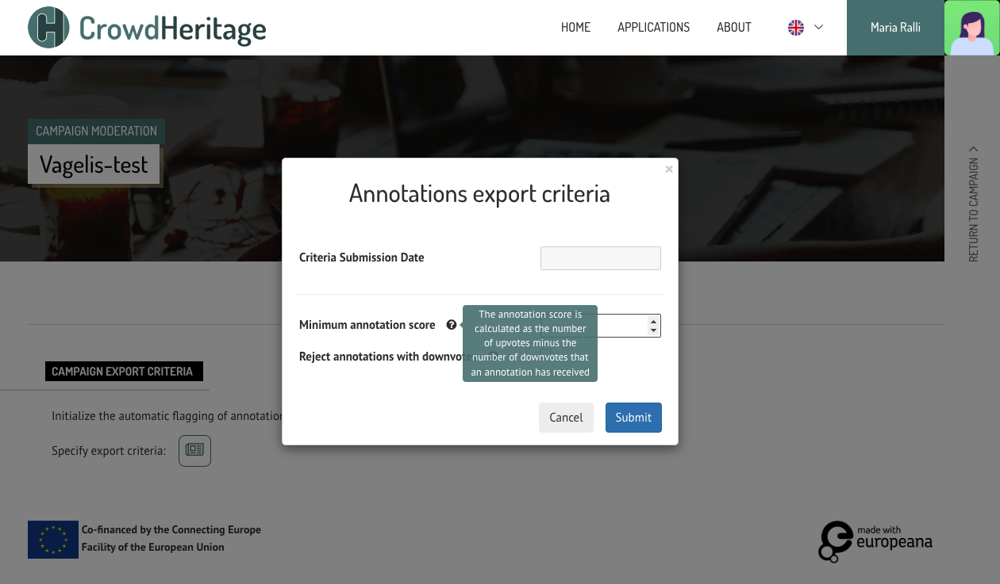

### Data Export
By clicking the *Data Export* button, the Campaign Owner can see the two campaign export options, *EXPORT CONTRIBUTORS* and *EXPORT ANNOTATIONS*.

#### EXPORT ANNOTATIONS
The Campaign Owner is presented with two options for exporting annotations. They can either copy the annotations download link into the clipboard or directly download the annotations file.

#### EXPORT Contibutors
There are two ways of exporting the campaign contributors: as CSV file (which contains a table with some basic information regarding the users), or as JSON file (which contains more detailed information about the contributing users).

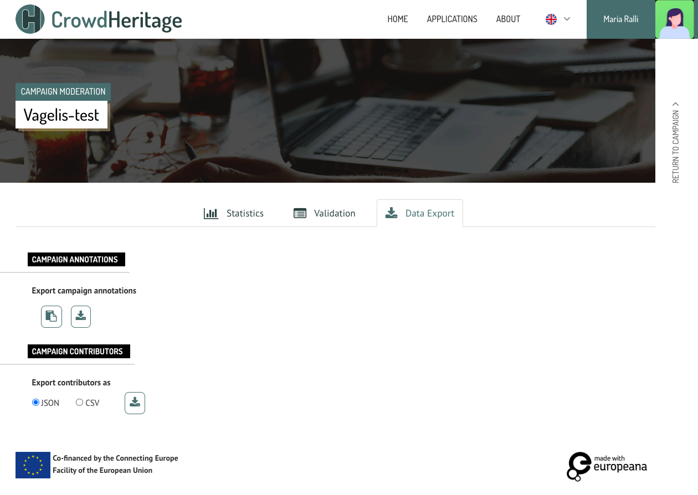

#### Export Annotations for MINT Tool
In case the Campaign Owner wants to export the annotations to ingest them into the MINT tool, they can simply copy the annotations download link and paste it into the respective MINT workspace to do a controlled import of the annotations.

<!-- 
local image example URL: "./_media/image1.jpg"
live image example URL: "https://raw.githubusercontent.com/ails-lab/CrowdHeritage_Documentation/main/docs/_media/image1.jpg"
-->
