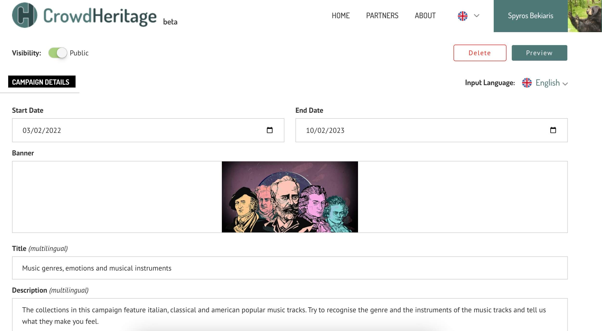
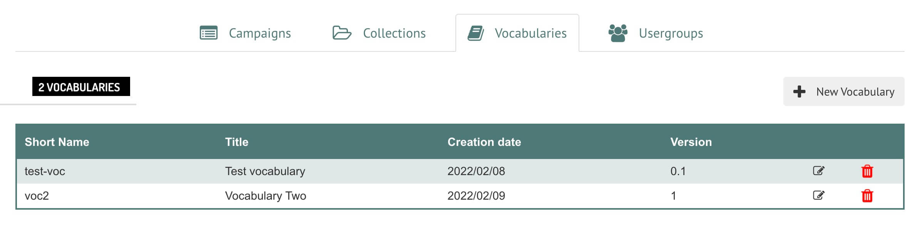
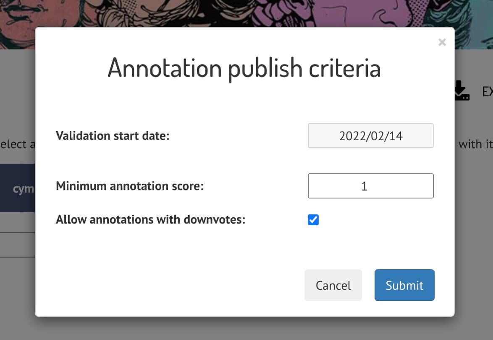

# CrowdHeritage Introduction

## What is CrowdHeritage?
CrowdHeritage is an online crowdsourcing platform for enriching the metadata of digitized cultural heritage material. The platform was developed under the Europeana Generic Services project [CrowdHeritage](https://pro.europeana.eu/project/crowd-heritage).

# Navigating CrowdHeritage Website

## Sign in / Sign up
Visit `https://crowdheritage.eu/` and click on the **Sign in** button on the top right. A pop-up will appear asking for your preferred sign in method, or giving you the option to create an account if you don't already have an account.
You can browse thought the Campaigns and Collections without logging in, but you will not be able to contribute.

## Choosing a Campaign
Once you have entered your credentials, you will now be able to see your username on the top right.
Scroll down through the Campaign list on the main page and enter any Campaign you would like to contribute to. In this example, we will select the *Scenes and People from China* Campaign.

## Entering a Collection
Each Campaign consists of one or more Collections. You can view those Collections under the Campaign information, by scrolling down further. Each listed Collection has a title, the number of items it contains, the name of its curator and a thumbnail made of some sample images form that Collection. Select the collection you are interested in and click on it to enter it.

## Selecting an Item
Within the Collection, you will be presented with a description of that Collection and the Items it contains. You also have the option to view or hide the Items you have already annotated, by selecting the ***View*** or ***Hide*** option on the selector.

By hovering on the thumbnail of an Item, you can either click on it to enter the Item or click on the *eye* icon on the top left of each image in order to preview it - like so:

If you want to create annotations for am Item, click on it to access its page.

## Annotating an Item
There are three annotation types one can add to an Item.
1. **Tags**
2. **Comments**
3. **Geotags**

### 1. TAGS
The first annotation type on the right sidebar are **tags**. Tags are predefined categories that can describe an Item. You can either *Upvote*, *Downvote* or *Remove* an existing tag by clicking the thumbs-up, thumbs-down or "X" icon next to that tag, respectively.

There is also the option to add a new tag by typing it in the input field. Since tags are predefined, once a user starts inserting text inside the input field, a list of relevant tags will appear in a drop-down list for the user to select most appropriate one.

### 2. COMMENTING
The second annotation type is a **comment**. Comments are text annotations, just like tags, with the essential difference that they are a free-text strings instead of predefined strings. If a user feels that the information contained in the tags is not adequate, they can add a custom text that conveys the information they want to add as an annotation.

Comments can also be *Upvoted*, *Downvoted* or *Removed* by other users. 

### 3. GEOTAGGING
Lastly, **geotagging** is a special kind of tag that refers specifically to a location. A user can start typing the location name in the input field under the map, and then select the appropriate location from the suggested ones on the drop-down below. Geotags can also be *Upvoted*, *Downvoted* or *Removed* by other users.

# Campaign Organizers' Tools
As a Campaign Organizer you have the additional capabilities to create and edit Campaigns, Collections, Vocabularies and Usergroups. As well as access to Campaign statistics and other moderating tools. We will first go through the **Dashboard** and then take a look on the **Moderating tools**.

## Dashboard
To access the dashboard, a signed-in Campaign Organizer should click on his username on the top right of the Navbar and then click on *Dashboard*.

Within the Dashboard, a user can view all the Campaigns, Collections, Vocabularies and Usergroups - each under the respective tab - as well as create new ones or edit existing ones.

### Create/Edit Campaign
To create a new Campaign, click on the *+ New Campaign* button on the top right of the **Campaigns** tab (as seen on the above screenshot). A sidebar will appear on the right, asking to choose the Campaign's shortname. If the shortname already exist, you will be notified to select another.

Once you click on the *Create* button, your new Campaign will appear on the Campaigns list and you can click on it to edit any or all of the details. There is a long list of input fields like: Visibility, Start/End Dates, Input Language, Banner, Description and so on. There are buttons to *Preview* and/or *Save* the Campaign after you are done.

The input fields marked as *(multilingual)* can be edited in multiple languages by selecting their appropriate language on the **Input Language** dropdown menu on top. This way, whenever a user views a Campaign, it will appear in their own language if the Campaign Owner has added the relevant text in the user's language.

### Create/Edit Collection
Creating a Collection is a similar process as creating a Campaign. The user has to navigate on the **Collections** tab and click on the *+ New Collection* button. 

Then fill the requested information, and select the newly created Collection to import Items in.

There are three options to import items when clicking the *Import Items* button.
1. Europeana Gallery - Import a whole gallery by entering the Europeana Gallery ID for that gallery
2. Europeana Search - Import a selected number of Items that contain a desired Search Term.
3. Europeana Items - Import specific Europeana Items by giving a list of those Items' URLs.

### Create/Edit Vocabulary
Creating a Vocabulary is a similar process. The user has to navigate on the **Vocabulary** tab and click on the *+ New Vocabulary* button. Name the vocabulary and click on the edit icon in order to add terms to it.

The terms can be either added one-by-one or batch imported as a CSV. They can also be Downloaded as a CSV. You can view all options by clicking *Manage Terms*.

### Create/Edit Usergroup
Lastly, we have Usergroups which follow a similar process. The user has to navigate on the **Usergroup** tab and click on the *+ New Usergroup* button to give the usergroup a name and description.

Once the group is created, click on the edit icon and add users in that group under the *Manage Users* section on the right sidebar.

## Moderate Campaign
When a Campaign Owner visits a Campaign page, a button named "Moderate Campaign" appears to him between the Campaign information and the Campaign's Collections.

This button navigates to a Campaign Validation page which provides some tools that only a Campaign Owner has access to.

### View annotations by TAG
By typing or selecting one of the available tags, like "Bass saxophone", a list of Items annotated with the chosen tag will appear.

**FIXME: Redo this example with one that returns Items**

### Campaign Statistics
By clicking the *Campaign Statistics* button, the Campaign Owner can view some statistics about that specific Campaign, like total items, total annotations, annotation upvotes etc.

### Publish Criteria
The *Publish Criteria* button opens a pop-up page with **FIXME: Not sure what that is?**

### Export Contributors and Annotations
The final two buttons give the Campaign Owner the option to export the contributing users and the annotations of the Campaign, as a JSON file.

<!-- 
local image example URL: "./_media/image1.jpg"
live image example URL: "https://raw.githubusercontent.com/ails-lab/CrowdHeritage_Documentation/main/docs/_media/image1.jpg"
-->
